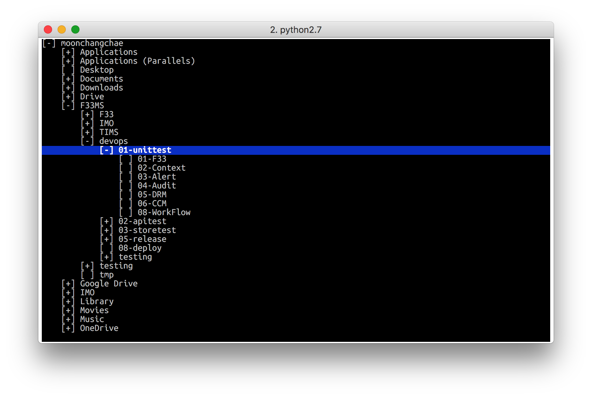

# treesel
Small python program select tree (and change) it using curses standard library.

## Screen shot



## Install

In virtualenv,

``` sh
(python) $ pip install treesel
```

or just for system python interpreter,

``` sh
$ sudo pip install treesel
```

## Run

``` sh
$ treesel $HOME
```
will show directory tree structure from $HOME.
If first parameter is omitted then treesel will show directory tree structure from current directory.

if `-s` or `--show_hidden`  option is given hidden directory will be showen, default is not show hidden directory.

For example, 

``` sh
$ treesel -s
```
### Operations
 * UP, DOWN - navigation between directories
 * RIGHT - expand sub-directories
 * LEFT - unexpand
 * ENTER - select the directory
 * ESC - cancel treesel
 
## How to change directory

``` sh
$ cd "$(treesel -s $HOME)"
```

If you are using `bash` then use `pushd`  insread of `cd`.

``` sh
$ pushd "$(treesel -s $HOME)"
```

After working at that directory you can just `popd` to return original directory.

``` sh
$ popd
```

## Practical use

You can add a alias at your home profile, $(HOME)/.bashrc or $(HOME)/.bash_profile.

```bash
tree_select() {
    pushd "$(treesel $@)"
}
alias ts=tree_select
```

And to work this alias make sure,

``` sh
$ source ~/.bashrc
``` 

In the long run,

``` sh
$ ts
$ ts ~
``` 

I will be happy if you are happy!

## Todo

Now python curses standard library does not support UTF-8 encoding. Please let me know If someone know how to solve this problem.
